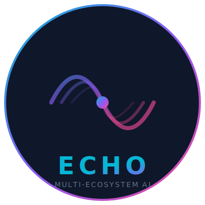

<div align="center">
  
  
  <h3>Multi-Ecosystem AI CLI Agent</h3>
  
  <p>
    <a href="https://github.com/chieji/echoctl"></a>
    <a href="https://www.npmjs.com/package/echo-ai-cli"></a>
    <a href="https://nodejs.org/"></a>
    <a href="https://www.typescriptlang.org/"></a>
    <a href="https://github.com/chieji/echoctl/blob/main/LICENSE"></a>
  </p>
  
  <p>
    <a href="https://github.com/chieji/ECHOMEN"><strong>Frontend Repo »</strong></a> •
    <a href="#features">Features</a> •
    <a href="#installation">Installation</a> •
    <a href="#usage">Usage</a> •
    <a href="#extensions">Extensions</a>
  </p>
  
  <p>
    <code>npm install -g echo-ai-cli</code>
  </p>
</div>

---

## 🚀 What is Echoctl?

**Echoctl** (Echo CLI) is a terminal-based AI agent that brings the power of ECHOMEN to your command line. It's not just another AI chatbot — it's a resilient, multi-provider agentic system that can execute real tasks on your machine.

### The Problem Echoctl Solves

Most AI CLIs lock you into one provider. Echoctl is different:
- ✅ **14 AI Providers**: Switch between Gemini, Claude, GPT-4, Qwen, Groq, and more
- ✅ **Extension System**: Import skills from Claude, Gemini, Qwen, or build your own
- ✅ **Zero-Config Tools**: Web search, Wikipedia, weather — no API keys needed
- ✅ **Smart Failover**: If one AI fails, automatically tries the next
- ✅ **MCP Compatible**: Works with Model Context Protocol servers

---

## ✨ Features

### 🤖 Multi-Provider AI Agent
- **14 Supported Providers**:
  - 🟦 Google Gemini
  - 🟢 OpenAI GPT
  - 🟠 Anthropic Claude
  - 🟣 Alibaba Qwen
  - 🔷 DeepSeek
  - 🌙 Moonshot Kimi
  - ⚡ Groq (Fast)
  - 🦙 Ollama (Local)
  - 🌐 OpenRouter (100+ models)
  - 🚀 Together AI
  - 🔴 ModelScope
  - 🌪️ Mistral AI
  - 🤗 Hugging Face
  - 🐙 GitHub Models

### 🔌 Extension Registry

```bash
# List all extensions
echo extension list

# Add a new extension
echo extension add my-api https://api.example.com

# Sync from Claude/Gemini
echo extension sync --claude
echo extension sync --gemini

# Set auth for extensions
echo extension auth weather-api apiKey=your-key
```

### 🌐 Zero-Config Web Tools

No API keys required:

```bash
# In agent mode:
"Search for latest AI news"
"Get Wikipedia summary of TypeScript"
"What's the weather in Lagos?"
"Show me top Hacker News stories"
```

Built-in tools:
- **Web Search**: DuckDuckGo integration
- **Wikipedia**: Article search & summaries
- **Reddit**: Posts from any subreddit
- **Hacker News**: Top & new stories
- **Weather**: Open-Meteo API
- **Archive.org**: Check URL archives
- **Web Scraping**: Extract content

### 🎯 Interactive Commands

```bash
# Model picker (interactive)
/models

# List providers
echo models list

# Switch provider
echo models set gemini

# Extension management
echo extension list
echo extension add <name> <url>
echo extension sync --all
```

### 🛡️ Safe Execution

3-tier sandbox protects your system:
- **Tier 1**: Pure computation (auto-execute)
- **Tier 2**: DOM manipulation (sandboxed)
- **Tier 3**: Full access (requires approval)

---

## 📦 Installation

### Option 1: Docker (For Server Deployment)

```bash
# Pull the image
docker pull chieji/echoctl:latest

# Run with your API keys
docker run -it --rm \
  -e GEMINI_API_KEY=your_key \
  -v ~/.echo-cli:/root/.config/echo-cli \
  chieji/echoctl:latest \
  echo repl
```

**Docker Compose:**

```yaml
version: '3.8'
services:
  echoctl:
    image: chieji/echoctl:latest
    container_name: echoctl
    environment:
      - GEMINI_API_KEY=${GEMINI_API_KEY}
      - OPENAI_API_KEY=${OPENAI_API_KEY}
    volumes:
      - ~/.echo-cli:/root/.config/echo-cli
    stdin_open: true
    tty: true
```

---

### Option 2: npm (Recommended for Desktop)

```bash
# Install globally
npm install -g echo-ai-cli

# Verify installation
echo --version
```

### Option 2: From Source

```bash
# Clone the repository
git clone https://github.com/chieji/echoctl.git
cd echoctl

# Install dependencies
npm install

# Build
npm run build

# Link globally
npm link
```

### Option 3: pnpm

```bash
pnpm add -g echo-ai-cli
```

---

## ⚡ Quick Start

### 1. Configure Your First Provider

```bash
# Interactive setup
echo auth login

# Or configure directly
echo auth gemini YOUR_API_KEY
```

### 2. Start a Chat Session

```bash
# Simple chat
echo chat "Explain quantum computing"

# Interactive REPL
echo repl
```

### 3. Run Agent Mode

```bash
# Execute a task
echo agent "List all Python files in this directory"

# With specific provider
echo agent --provider groq "Find all TODO comments in my code"
```

---

## 🎯 Usage

### Chat Mode

```bash
# One-off question
echo chat "What's the capital of France?"

# Start interactive session
echo repl

# In REPL:
> /help          # Show commands
> /models        # Interactive model picker
> /mode agent    # Switch to agent mode
> /exit          # Exit REPL
```

### Agent Mode

```bash
# Simple task
echo agent "Count lines of code in src/"

# With options
echo agent --yolo "Delete all node_modules directories"
echo agent --plan "Analyze my project structure"
```

### Extension Commands

```bash
# List extensions
echo extension list
echo extension list --configured

# Add extension
echo extension add weather https://api.open-meteo.com

# Sync from other AI systems
echo extension sync --claude
echo extension sync --gemini
echo extension sync --all

# Set auth
echo extension auth my-api apiKey=xxx secret=yyy
```

### Model Management

```bash
# List all providers
echo models list

# Show only configured
echo models list --configured

# Set default
echo models set gemini
echo models set openai --model gpt-4o

# Show current config
echo models info
```

---

## 🔗 Related Repos

### ECHOMEN Ecosystem

- **[ECHOMEN Frontend](https://github.com/chieji/ECHOMEN)** — Full-stack AI workstation
  - Web-based UI
  - Visual task pipeline
  - Artifact viewer
  - Settings dashboard

### Architecture

```
┌──────────────────────────────────────────┐
│            Echoctl CLI                    │
├──────────────────────────────────────────┤
│  REPL      │  Agent    │  Extensions    │
│  Chat      │  Tools    │  MCP Client    │
├──────────────────────────────────────────┤
│         Provider Chain                     │
│  Gemini │ Claude │ GPT │ Qwen │ Groq    │
└──────────────────────────────────────────┘
```

---

## 📖 Configuration

### Config File Location

```
~/.config/echo-cli/config.json
```

### Example Configuration

```json
{
  "defaultProvider": "gemini",
  "defaultModel": "gemini-2.5-flash",
  "providers": {
    "gemini": {
      "apiKey": "your-key-here"
    },
    "openai": {
      "apiKey": "your-key-here"
    }
  }
}
```

### Environment Variables

```bash
# Set API keys via environment
export GEMINI_API_KEY=your_key
export OPENAI_API_KEY=your_key

# Custom config directory
export ECHO_CONFIG_DIR=/path/to/config
```

---

## 🛡️ Security

### What Echoctl Does

- ✅ API keys stored in encrypted config
- ✅ Command allowlisting for shell execution
- ✅ Path traversal prevention
- ✅ SSRF protection for web requests
- ✅ 3-tier code sandbox
- ✅ User approval for dangerous operations

### What Echoctl Doesn't Do

- ❌ No arbitrary code execution without approval
- ❌ No sending keys to third parties
- ❌ No persistent storage of sensitive data in plaintext

---

## 📚 Documentation

| Guide | Description |
|-------|-------------|
| [Getting Started](./docs/getting-started.md) | First steps with Echoctl |
| [Extensions](./docs/extensions.md) | Building and using extensions |
| [MCP Integration](./docs/mcp.md) | Model Context Protocol setup |
| [Security](./docs/security.md) | Security model and best practices |

---

## 🤝 Contributing

Contributions welcome! See [CONTRIBUTING.md](./CONTRIBUTING.md) for:
- Development setup
- Adding new providers
- Building extensions
- Testing guidelines

---

## 📊 Tech Stack

- **TypeScript** — Type-safe development
- **Commander.js** — CLI framework
- **Enquirer** — Interactive prompts
- **Chalk** — Terminal colors
- **Ora** — Loading spinners
- **Axios** — HTTP client
- **Playwright** — Browser automation

---

## 🐛 Troubleshooting

### "No providers configured"

```bash
# Run interactive setup
echo auth login

# Or configure manually
echo auth gemini YOUR_KEY
```

### "Command not found: echo"

```bash
# Reinstall globally
npm install -g echo-ai-cli

# Check PATH
echo $PATH | grep npm
```

### Extensions not loading

```bash
# Check config
echo extension list

# Re-sync
echo extension sync --all
```

---

## 📈 Roadmap

### Q2 2026
- [ ] Voice input support
- [ ] Local LLM improvements
- [ ] More MCP servers
- [ ] Extension marketplace

### Q3 2026
- [ ] Team collaboration
- [ ] Advanced analytics
- [ ] Mobile app
- [ ] Plugin SDK

---

## 🙏 Acknowledgments

Inspired by:
- [Model Context Protocol](https://modelcontextprotocol.io/)
- [Claude Code](https://claude.ai/code)
- [Aider](https://aider.chat/)
- [Continue.dev](https://continue.dev/)

---

## 📄 License

MIT License — see [LICENSE](./LICENSE) for details.

---

<div align="center">
  <p>Built with ❤️ by <a href="https://github.com/chieji">chieji</a></p>
  <p>⭐ Star this repo if you find it useful!</p>
  <p><a href="https://github.com/chieji/ECHOMEN">Check out the Frontend →</a></p>
</div>
